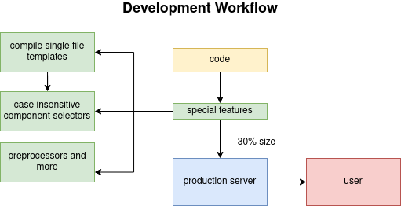

<h1 style="text-align:center;">Vue.js</h1>

<p style="text-align:center;">A Javascript framework for building Single Page Apps (SPAs).</p>

Table of Contents
=================

   * [Vue.js](#vuejs)
   * [Basics](#basics)
      * [Data Property](#data-property)
      * [Methods](#methods)
      * [Vue Instance Lifecycle](#vue-instance-lifecycle)
      * [Computed Property](#computed-property)
      * [Watch Property](#watch-property)
      * [Directives](#directives)
            * [Shortcuts](#shortcuts)
      * [Dynamic Styles](#dynamic-styles)
         * [Array Sytax](#array-sytax)
   * [Vue CLI &amp; Workflows](#vue-cli--workflows)
      * [Development Workflow](#development-workflow)
      * [Components](#components)
         * [Registering Components Locally](#registering-components-locally)
      * [Communicating between Components](#communicating-between-components)
         * [Parent -&gt; <strong>Child</strong>](#parent---child)
         * [Child -&gt; Parent](#child---parent)
         * [Child -&gt; Child](#child---child)
            * [Method #1](#method-1)
            * [Method #2](#method-2)
            * [Method #3](#method-3)
            * [Event Bus](#event-bus)
      * [Advanced Components](#advanced-components)
         * [Slots](#slots)
            * [Multiple Slots](#multiple-slots)
         * [Dynamic Components](#dynamic-components)
      * [Custom Directives](#custom-directives)
         * [Passing values to custom directives](#passing-values-to-custom-directives)
            * [Arguments](#arguments)
            * [Modifiers](#modifiers)
         * [Registering Directives locally](#registering-directives-locally)
      * [Filters](#filters)
      * [Mixins](#mixins)
   * [Animations](#animations)
      * [Transition](#transition)
         * [Assigning CSS classes for Transitions](#assigning-css-classes-for-transitions)
      * [Animation](#animation)
            * [Onload animation](#onload-animation)
      * [Custom CSS Classes Names](#custom-css-classes-names)
      * [Transitioning between Multiple Elements](#transitioning-between-multiple-elements)
      * [Transition JS Hooks](#transition-js-hooks)
      * [Multiple Elements Animations](#multiple-elements-animations)
   * [Vue Router](#vue-router)
      * [Route Parameters](#route-parameters)
         * [Query parameters](#query-parameters)
      * [Nested Routes](#nested-routes)
      * [Scroll behavior](#scroll-behavior)
      * [Navigation Guards](#navigation-guards)
      * [Lazy Loading](#lazy-loading)
   * [Vuex - Better State Management](#vuex---better-state-management)
      * [Install](#install)
      * [Store](#store)
      * [Getters](#getters)
         * [Mapping Getters to Properties](#mapping-getters-to-properties)
      * [Mutations](#mutations)
      * [Actions](#actions)
            * [Edge with v-model](#edge-with-v-model)
      * [Modularizing the Store](#modularizing-the-store)

# Basics

A simple Vue.js built in the browser looks like this.

```html
<div id="app">
  {{ message }}
</div>

<script>
    const app = new Vue({
        el: '#app',
        data: {
            message: 'Hello Vue!'
        }
    });
</script>
```

We bind the application to a root element, in this case a DIV. Every Vue application starts by creating a new **Vue instance** with the `Vue` function.

A Vue application consists of a **root Vue instance** created with `new Vue`, optionally organized into a tree of nested, reusable components. For  example, a todo app’s component tree might look like this:

```
Root Instance
└─ TodoList
   ├─ TodoItem
   │  ├─ DeleteTodoButton
   │  └─ EditTodoButton
   └─ TodoListFooter
      ├─ ClearTodosButton
      └─ TodoListStatistics
```

## Data Property

When a Vue instance is created, it adds all the properties found in its `data` object to Vue’s **reactivity system**. When the values of those properties change, the view will “react”, updating to match the new values.

We use the ``` {{ }} ``` syntax to display dynamic values taken from the ``data`` property (see [Basics](#Basics)). We can also put small JS syntax inside ``{{ }}``.

```javascript
const vm = new Vue({
    el: '#app',
    
    data: {
        num = 100;
    }
});
```

When this data changes, the view will re-render.

**The data property is not reactive.**

## Methods

Methods can also be accessed in the view with the ``{{ }}`` syntax:

```html
<div id="app">
  {{ sayHello() }}
</div>

<script>
    const app = new Vue({
        el: '#app',
        data: {
            message: 'Hello Vue!'
        }
        methods: {
            sayHello() {
                return 'Hello!';
    	    }
    	}
    });
</script>
```

The ``{{ }}`` syntax can't be used in every element attribute:

```html
<!-- NO -->
<a href="{{ link }}">Link</a>
```

We need to use [**Directives**](#Directives).

```html
<a v-bind:href="link">Link</a>
```

## Vue Instance Lifecycle


We have access to different methods for different periods in the lifecycle of an instance. For example we can use the ``created()`` method and run code once the Vue instance gets created.

See documentation for more methods.

## Computed Property

With the computed property we can execute a function only if its relative data gets changed. The methods are called every time we dynamically refresh the page. For example let's assume we have some buttons that increase a counter:

```html
<div id="app">
    <button v-on:click="counter++">Increase</button>
    <button v-on:click="counter--">Decrease</button>
    <button v-on:click="secodCounter++">Increase second</button>
    
    <p>Counter: {{ counter }}</p>
    <p>Result: {{ result() }} | {{ output }}</p>
</div>

<script>
    new Vue({
        el: '#app',
        data: {
            counter: 0,
            seconCounter: 0
        },
        computed: {
            output() {
                return this.counter > 5 ? 'Greater than 5' : 'Smaller than 5'
            }
        },
        methods: {
            result() {
                return this.counter > 5 ? 'Greater than 5' : 'Smaller than 5'
            }
        }
    });
</script>
```

The result function gets called every time because Vue doesn't know if it needs to run it or not. On the other hand the output function gets called only when the counter gets modified.

Computed is aware of the logic inside it. See how we use 'output' as a property and we don't invoke the function.

Computed properties are by default getter-only, but you can also provide a setter when you need it:

## Watch Property

An object where keys are expressions to watch and values are the  corresponding callbacks. The value can also be a string of a method  name, or an Object that contains additional options. 

Vue does provide a more generic way to observe and react to data changes on a Vue instance: **watch properties**. When you have some data that needs to change based on some other data, it is tempting to overuse `watch` owever, it is often a better idea to use a computed property rather than an imperative `watch` callback

The watch property lets us react to changes. Computed properties are much more optimized and they are best practice but they need to run **SYNC**.

The watch property is **ASYNC**.

## Directives

Directives are special Vue commands.

| keyword |                            action                            |
| :-----: | :----------------------------------------------------------: |
| v-bind  |           bind some data dynamically to something            |
|  v-if   |                         if statement                         |
| v-else  |                        else statement                        |
|  v-for  |                           for loop                           |
| v-once  |            freezes dynamic updating (hot reload)             |
| v-html  |       outputs raw html data from a value ([!] XSS [!])       |
|  v-on   |                listens on an event (click...)                |
| v-model | Create a two-way binding on a form input element or a component. |
|         |                                                              |

#### Shortcuts

v-on: --> @

v-bind: --> :


## Dynamic Styles

We can pass an object to `v-bind:class` to dynamically toggle classes:

```html
<div v-bind:class="{ active: isActive }"></div>
```

The above syntax means the presence of the `active` class will be determined by the [truthiness](https://developer.mozilla.org/en-US/docs/Glossary/Truthy) of the data property `isActive`.

You can have multiple classes toggled by having more fields in the object. In addition, the `v-bind:class` directive can also co-exist with the plain `class` attribute. So given the following template:

```html
<div
  class="static"
  v-bind:class="{ active: isActive, 'text-danger': hasError }"
></div>
```

And the following data:

```javascript
data: {
  isActive: true,
  hasError: false
}
```

It will render:

```html
<div class="static active"></div>
```

The bound object doesn’t have to be inline:

```html
<div v-bind:class="classObject"></div>
```

```javascript
data: {
  classObject: {
    active: true,
    'text-danger': false
  }
}
```

This will render the same result. We can also bind to a [computed property](https://vuejs.org/v2/guide/computed.html) that returns an object. This is a common and powerful pattern:

```html
<div v-bind:class="classObject"></div>
```

```javascript
data: {
  isActive: true,
  error: null
},
computed: {
  classObject: function () {
    return {
      active: this.isActive && !this.error,
      'text-danger': this.error && this.error.type === 'fatal'
    }
  }
}
```

### Array Sytax

We can pass an array to `v-bind:class` to apply a list of classes:

```html
<div v-bind:class="[activeClass, errorClass]"></div>
```

```javascript
data: {
  activeClass: 'active',
  errorClass: 'text-danger'
}
```

Which will render:

```html
<div class="active text-danger"></div>
```

If you would like to also toggle a class in the list conditionally, you can do it with a ternary expression:

```html
<div v-bind:class="[isActive ? activeClass : '', errorClass]"></div>
```

This will always apply `errorClass`, but will only apply `activeClass` when `isActive` is truthy.

# Vue CLI & Workflows

Workflows optimize our code in multiple ways. We need, though, a development server:

This server will pre-compile and then serve the Vue app to the client, this is good for clientside performance.

All of this is pre-built, we don't need to write our own static server. 

## Development Workflow

We compile everything server so the app we ship is ready to be viewed. This means that we can use Single FIled Templates (.vue files).




## Components

Re-usable pieces of code that are used in the Vue instance. It's like splitting the app in different parts based on their role. Components extend the Vue instance. 

**The data property in components must be a function**

```javascript
Vue.component('ComponentName', {
    data() {
        return {
            str: 'Hello from component'
        };
    }
});

new Vue({
    el: '#app',
    data: {
        str: 'Hello'
    }
});
```

```html
<div id="app">
    <ComponentName />
    <ComponentName />
    <ComponentName />
</div>

<!-- as you can see we can re-use components -->
```

We could also have a shared data object by defining it globally but it is better to have it locally inside every component.

### Registering Components Locally

```javascript
// global
Vue.component('ComponentName', {
    data() {
        return {
            str: 'Hello from global component'
        };
    }
});
```

```javascript
// local
const ComponentName = {
    data() {
        return {
            str: 'Hello from local'
        }
    }
}

const vm = new Vue({
   	components: {
        ComponentName
    } 
});
```

We can of course move components to a separated file and import it like a JS module.

```html
<template>
    <p>
        {{ str }}
    </p>
    <ComponentName />
</template>

<script>
    import ComponentName from './components/ComponentName.vue';
    
    export default {
        components: {
            ComponentName
        },
        
        data: {
            str: 'Hello'
        }
    }
</script>
```

We can also organize components by feature instead of having a single ``components`` folder.

## Communicating between Components

### Parent -> **Child**

How can we share data from parent to child?

For transferring data from the parent to the child we use ``props``.

```html
<!-- child -->
<template>
    <p>
        {{ name }}
    </p>
</template>

<script>
    export default {
        props: ['name']
    }
</script>
```

```html
<!-- parent -->
<template>
    <div>
        <ChildComponent v-bind:name="name" />    <!-- we need v-bind -->
    </div>
</template>

<script>
    export default {
        data() {
            return {
            	name: 'Leonardo'    
            }
        }
    }
</script>
```

We can also use the props inside methods using the keyword ``this``, just like accessing the data property

Props can also be an object, it is useful if you want to do some validation.

```javascript
export default {
    props : {
     	name: String,
        required: true
    }
}
```

### Child -> Parent

How can we share data from a child to his parent?

Since passing data from parent to child means passing pointers we use the ``$emit`` method.

```javascript
export default {
    resetName() {
        this.name = 'Reverted back';
        this.$emit('eventName', this.name);
    }
}
```

And then in the parent we listen to this event with the v-on directive.

``v-on:eventName="name = $event"`` ($event refers to the data passed to the event).

### Child -> Child

* #### Method #1

  ​	Emetting event like we did [here](###Child -> Parent).

* #### Method #2

  ​	Passing a callback as a prop

* #### Method #3

  ​	Using an Event Bus, which is a separeted Vue instance. We use ``$emit`` with this instance 	and we listen from events coming from that Bus.

#### Event Bus

###### DEPRECATION WARNING

With Vue 3 the use of a Vue instance as Event Bus is deprecated.
In case an event bus was needed the use of libraries such as [mitt](https://github.com/developit/mitt) is suggested. Also [Vuex](#vuex---better-state-management) is a good alternative for bigger applications.

```javascript
// main.js
import Vue from 'vue'
import App from './App.vue'

export const eventBus = new Vue({
    methods: {
        changeAge(age) {
            this.$emit('ageWasEdited', age);
        }
    }
});

new Vue({
  el: '#app',
  render: h => h(App)
})
```

```html
<!-- child 1 -->
<template>
    <div class="component">
        <h3>You may edit the User here</h3>
        <p>Edit me!</p>
        <p>User Age: {{ userAge }}</p>
        <button @click="editAge">Edit Age</button>
    </div>
</template>

<script>
    import {eventBus} from '../main';

    export default {
        props: ['userAge'],
        methods: {
            editAge() {
                this.userAge = 30;
                
                eventBus.changeAge(this.userAge);
            }
        }
    }
</script>
```

```html
<!-- child 2 -->
<template>
    <div class="component">
        <h3>You may view the User Details here</h3>
        <p>Many Details</p>
        <p>User Name: {{ switchName() }}</p>
        <p>User Age: {{ userAge }}</p>
        <button @click="resetName">Reset Name</button>
        <button @click="resetFn()">Reset Name</button>
    </div>
</template>

<script>
    import { eventBus } from '../main';

    export default {
        props: {
            myName: {
                type: String
            },
            resetFn: Function,
            userAge: Number
        },
        methods: {
            switchName() {
                return this.myName.split("").reverse().join("");
            },
            resetName() {
                this.myName = 'Max';
                this.$emit('nameWasReset', this.myName);
            }
        },
        created() {
            eventBus.$on('ageWasEdited', (age) => {
                this.userAge = age;
            });
        }
    }
</script>
```

```html
<!-- parent -->
<template>
    <div class="component">
        <h1>The User Component</h1>
        <p>I'm an awesome User!</p>
        <button @click="changeName">Change my Name</button>
        <p>Name is {{ name }}</p>
        <p>Age is {{ age }}</p>
        <hr>
        <div class="row">
            <div class="col-xs-12 col-sm-6">
                <app-user-detail
                        :myName="name"
                        @nameWasReset="name = $event"
                        :resetFn="resetName"
                        :userAge="age"></app-user-detail>
            </div>
            <div class="col-xs-12 col-sm-6">
                <app-user-edit
                        :userAge="age"
                        @ageWasEdited="age = $event"
                ></app-user-edit>
            </div>
        </div>
    </div>
</template>

<script>
    import UserDetail from './UserDetail.vue';
    import UserEdit from './UserEdit.vue';

    export default {
        data: function () {
            return {
                name: 'Max',
                age: 27
            };
        },
        methods: {
            changeName() {
                this.name = 'Anna';
            },
            resetName() {
                this.name = 'Max';
            }
        },
        components: {
            appUserDetail: UserDetail,
            appUserEdit: UserEdit
        }
    }
</script>
```

```html
<!-- App.vue -->
<template>
    <div class="container">
        <div class="row">
            <div class="col-xs-12">
                <app-user></app-user>
            </div>
        </div>
    </div>
</template>

<script>
    import User from './components/User.vue';

    export default {
        components: {
            appUser: User
        }
    }
</script>
```

We could also use **Vuex** to simplify State Management.

## Advanced Components

### Slots

With slots we can pass content (entire HTML blocks) between components 

```html
<!-- parent -->
<template>
	<div>
        <Quote>
            <!-- this is going inside the slot component in the child -->
            <h1>Quote Title</h1>
            <p>The quote</p>
        </Quote>
    </div>
</template>

<script>
    import Quote from './components/Quote.vue';
    
    export default {
        components: {
            Quote
        }
    }
</script>
```

```html
<!-- child -->
<template>
	<div>
        <slot></slot>
    </div>
</template>

<script>
    export default {
        
    }
</script>
```

**Styiling of content passd to the slot is done inside the child.** 

Rendering and dynamic content is related to the parent.

#### Multiple Slots

If you want to render the content multiple times then just place as many ``<slot>`` as you want.

But we can also name slots:

```html
<!-- parent -->
<template>
	<div>
        <Quote>
            <!-- this is going inside the slot component in the child -->
            <h1 slot="title">Quote Title</h1>
            <p slot="content">The quote</p>
        </Quote>
    </div>
</template>

<script>
    import Quote from './components/Quote.vue';
    
    export default {
        components: {
            Quote
        }
    }
</script>
```

```html
<!-- child -->
<template>
	<div>
        <slot name="title"></slot>
    </div>
    
    <div>
        <slot name="content"></slot>
    </div>
</template>

<script>
    export default {
        
    }
</script>
```

If you name 3/4 slots the 4th one is going to be called the "default" one.

### Dynamic Components

The ``<component>`` element allows us to dynamically add components

```html
<!-- parent -->
<template>
    <div>
        <button @click="selectedComponent = 'C1'">C1</button>
        <button @click="selectedComponent = 'C2'">C2</button>
        <button @click="selectedComponent = 'C3'">C3</button>
    </div>
    
    <component v-bind:is="selectedComponent"></component>
</template>

<script>
    import C1 from './components/C1.vue';
    import C2 from './components/C2.vue';
    import C3 from './components/C3.vue';
    
    export default {
        components: {
            C1,
            C2,
            C3
        }
        
        data() {
            return {
                selectedComponent = 'C1'
            }
        }

    }
</script>
```

Dynamic Components get destroyed and re-created every time, but we can over write this behaviour with the ``<keep-alive>`` tag around the dynamic ``<component>`` element.

We can control this flow with life cycle methods such as ``activated`` and ``deactivated``.


## Custom Directives

Directives have hooks:

* bind (once the directive is attached)

* inserted (inserted in the parent node)

* update (once component is updated w/o children)

* componentUpdated (once component is updated w/ children)

* unbind (when directive is removed)

  

Registering them globally in the ``main.js`` file.

```javascript
Vue.directive('directive-name', {
    bind(el, binding, vnode) {
        el.style.backgroundColor = 'green';
    }
});
```

```html
<p v-directive-name>
    Hello
</p>
```

### Passing values to custom directives

```javascript
Vue.directive('directive-name', {
    bind(el, binding, vnode) {
        el.style.backgroundColor = binding.value;
    }
});
```

```html
<p v-directive-name="'red'">
    Hello
</p>
```

#### Arguments

```javascript
Vue.directive('directive-name', {
    bind(el, binding, vnode) {
        if (binding.arg == 'background') {
            el.style.backgroundColor = binding.value;
        } else {
            el.style.color = binding.value;
        }
        
    }
});
```

```html
<p v-directive-name:background="'red'">
    Hello
</p>
```

#### Modifiers

```javascript
Vue.directive('directive-name', {
    bind(el, binding, vnode) {
        let delay = 0;
        if (binding.modifiers['delayed']) {
            delay = 3000;
        }
        
        setTimeout(() => {
            if (binding.arg == 'background') {
            	el.style.backgroundColor = binding.value;
            } else {
            	el.style.color = binding.value;
            }
        }, delay);
    }
});
```

```html
<p v-directive-name:background.delayed="'red'">
    Hello
</p>
```


### Registering Directives locally

we can use the ``directives`` properties inside the ``<script>`` tag.

```html
<script>
	export default {
        directives: {
            'directive-name': {
                bind(el, binding, vnode) {
                    let delay = 0;
                    if (binding.modifiers['delayed']) {
                        delay = 3000;
                    }

                    setTimeout(() => {
                        if (binding.arg == 'background') {
                            el.style.backgroundColor = binding.value;
                        } else {
                            el.style.color = binding.value;
                        }
                    }, delay);
                }
            }
        }
    }
</script>
```


## Filters

A filter is a syntax feature you can use to transform some output in the **template**, it basically filters some **data**. For example, a filter that does ``toUppercase()``. This will happen in the template only, not in the ``data()``.

```javascript
// globally
import Vue from 'vue';

Vue.filter('filter-name', (value) => {
    return value.toLowerCase();
});
```

```javascript
// locally

export default {
    filters: {
        toUppercase(value) {
            return value.toUpperCase();
        }
    }
}
```

**FIlters requires at leats one parameter.**

And we use them like this.

```html
<p>
    {{ text | toUppercase }}
</p>

<script>
export default {
    data() {
        return {
            text: 'Hello'
        };
    },
    filters: {
        toUppercase(value) {
            return value.toUpperCase();
        }
    }
}
</script>
```

We can chain them by doing:

 ``{{ data | filtername | anotherfilter | anotherone }} ``

Sometimes, computed properties are a better solution than filters.


## Mixins

Mixins are useful to avoid duplicate code, often involving computed properties and filters.

We basically move the code we need to an external file where we export an object with those methods inside. Then we use the ``mixins`` property in out Vue instance:

```javascript
// mixin
const example = {
  	data() {
        return {
            text: 'Hello'
        }
    },
    methods: {
        printText() {
            console.log(this.text);
        }
    }
};
export default example;
```


```javascript
import example from './exampleMixin.js';

export default {
    mixins: [example]
}
```

IMPORTANT

**A mixin gets merged with the already existing properties in the instance**. 

Components always act last and mixins can't destroy components stuff.

The mixin object is not really shared between components, every component gets his copy of the mixin.

# Animations

We can use animations and transitions when creating, modifying and deleting components.

## Transition

We can use the ``transition`` component to animate a **single** element.

```html
<transition>
    <p>
        Hey!
    </p>
</transition>
```

We usually attach CSS classes to do animations and Vue does this for us.

We animate in an element with ``*-enter``  where ``*`` is the name of the animation displayed in the initial state. After this ``*-enter-active`` gets attached. 

For leaving Vue attaches ``*-leave`` and then ``*-leave-active``.

The default name is ``v-enter``.

### Assigning CSS classes for Transitions

Example:

```html
<transition name="fade">
    <p>
        Hey!
    </p>
</transition>

<style>
    /* one frame at the beginning and then gets removed */
    .fade-enter {
        opacity: 0;
    }
    
    /* here we set up the transition */
    .fade-enter-active {
        transition: opacity 1s;
    }
    .fade-leave {
        
    }
    .fade-leave-active {
        trabistion: opacity 1s;
        opacity: 0;
    }
</style>
```


## Animation

```html
<transition name="slide">
    <p>
        Hey!
    </p>
</transition>

<style>
    .slide-enter {

    }
    
    .slide-enter-active {
        animation: slide_in 1s ease-out forwards;
    }
    .slide-leave {
        
    }
    .slide-leave-active {
        animaiton: slide_out 1s ease-out forwards;
    }
    @keyframes slide-in {
        from {
            transform: translateY(20px);
        }
        to {
            transation: translationY(0);
        }
    }
    
    @keyframes slide-out {
        from {
            transform: translateY(0);
        }
        to {
            transation: translationY(20px);
        }
    }
</style>
```


If you want to mix animation and transitions make sure to indicate which one determines the lenght of the effect with the ``type=''`` keyword.

#### Onload animation

We can use the initial attachment to the DOM with the ``appear`` attribute on the ``transition`` element.

## Custom CSS Classes Names

If we don't want to use the default ``v-enter``, ``v-leave`` etc. We can assign custom names to them:

```html
<transition 
            enter-class="custom-name" 
            enter-active-class="custom-name"
            leave-class="custom-name"
            leave-active-class="custom-name"
></transition>
```


## Transitioning between Multiple Elements

If we want to transition between elements instead of animating a single one and then removing it we should add the ``key`` attribute to the elements., often we also need to use ``mode="out-in"``. 


## Transition JS Hooks

The ``transition`` element emits some events in a specific moment. The flow is:

``before-enter, enter, after-enter, after-enter-cancelled, before-leave, leave, after-leave and after-leave-cancelled``.

We can obviously listen to those events like: ``@before-enter="someMethod"``. So we can basiccaly execute code during those events. **The methods receive the element where we listen as a parameter**. We also need to tell Vue when to stop executing our animations inside the ``enter`` and ``leave`` hooks with the ``done()`` call inside them which is also a parameter.

If we don't want to use CSS at all we can explicitly tell Vue with ``:css="false"``.

## Multiple Elements Animations

To animate multiple items we have ``<transition-group>`` and we always need to key the elements

 ```html
<transition-group>
    <ul>
    	<li v-for="(element, index) in numbers" :key="element">
    	</li>
	</ul>
</transition-group>

 ```

``<transition-group>`` gives us a new CSS class: ``*-move`` used to move elements.

# Vue Router

If we use ``history`` mode every action is sent to the server, on the other hand the ``hash `` mode handles everything client-side in the application itself but we will get the ``#`` in the URL.

## Route Parameters

If we need to pass dynamic data to the route we can use: ``/somePath/:parameterName``.

If we want to retreive the dynamic parameter we have to use: ``this.$route.params.parameterName``. This doesn't get updated if we have multiple routes with multiple parameters in the same component. We can bypass this by using the ``watch`` property.

```javascript
data() {
  return {
    parameterName: this.$route.params.parameterName  
  };  
},
watch: {
    '$route': (to, from) {
        this.parameterName = to.params.id;
    }
}
```

### Query parameters

We can obviously use the `?` query parameter  and retreive it with  ``$route.query.queryName``.

## Nested Routes

To have nested routes we add the `children: []` property to the route object.

```javascript
{ path: '/user', component: User, children: [
    { path: ':id', component: UserID}
]}
```

And we need to add the ``<router-view>`` inside the 'root' route, in this case the `/user` route.

## Scroll behavior

We can modify the scroll behaviour with this method:

```javascript
// to: is the route we want to navigate to
scrollBehavior(to, from, savedPosition) {
    return {x: 0, y: 700};
}
```

``savedPosition`` is the position on the page where the user was before switching route.

## Navigation Guards

Middlewares that we can run before or after entering a route. This is useful especially for protected toutes.

Inside ``index.js`` in the ``router`` folder we use ``router.beforeEach()`` to run code before entering a route:

```javascript
router.beforeEach((to, from, next) => {
  if (to.meta.requiresAuth) {
    // need to login
  } else {
    next();
  }
});
```

Where meta is a property on a specific route:

```javascript
  {
    path: '/profile',
    name: 'Profile',
    component: () => import('../views/Profile.vue'),
    meta: {
      requiresAuth: true
    }
  }
```

Example:

```javascript
router.beforeEach((to, from, next) => {
  if (to.meta.requiresAuth) {
    UserService.isLoggedIn().then(result => {
      if (result.user) {
        next();
      } else {
        next({
          name: 'Login'
        });
      }
    }).catch(err => {
      console.error(err);
    });
  } else {
    next();
  }
});
```

## Lazy Loading

Lazy loading means we load only what we need.

With webpack we can control the loading of the routes.

```javascript
const User = resolve => {
    require.ensure(['./components/User.vue'], () => {
        resolve(require('/components/User.vue'));
    });
}
```

Whenever we want to load the User component we execute this function, which will load the User component only when we need it.


# Vuex - Better State Management

In big applications, an Event Bus may get really crowded and changes are hard to track.

That's why we may want **Vuex**. 

Vuex uses a central **Store** thats holds the application state. This store is available to the components, which can access it and modify it. In the central state we place all the shared data.

The **Store** is a JavaScript file called **store.js**.

## Install

``npm install vuex --save``

## Store

Example of a store.js

```javascript
import Vue from 'vue'
import Vuex from 'vuex';

Vue.use(Vuex);

const Store = new Vuex.Store({
   	state: { // properties our app has
        counter: 0
    } 
});

export default Store;
```

And then we register it as a property inside the root Vue instance.

Once it is registered we can access it everywhere with: ``this.$store.state.counter``.

## Getters

To avoid duplicated code we can use ``getters`` to fetch the store from different places.

```javascript
const Store = new Vuex.Store({
    state: { // properties our app has
        counter: 0
    },
    getters: {
        doubleCounter(state) {
            return state.counter * 2;
        }
    }
});
```

And we can access it with ``this.$store.getters.doubleCounter``.

### Mapping Getters to Properties

```javascript
import { mapGetters} from 'vuex';

export default {
    computed: {
        ...mapGetters([
        	'doubleCounter',
        	'anotherGetter'
    	]),
        ourOwnComputedProperty() {
            // code
        }
    }
}
```

And we can use them like this: ``{{ doubleCounter }}``.

## Mutations

Mutate the store. Mutations are committed from a component. 

```javascript
mutaions: {
    increment: state => {
        state.counter++;
    }
}
```

And we use it like this: ``this.$store.commit('increment')`` in a component. We can even use them like we did with `mapGetters`.

```javascript
import {mapMutations} from 'vuex';
export default {
    methods: {
        ...mapMutations([
            'increment'
        ])
    }
}
```

Mutations are **SYNC**, not **ASYNC**.

If we want to use ASYNC code in mutations we have to use ``actions``.

## Actions

Extra piece of async code in mutations. The mutation gets committed once the action is finished. (Actions are triggered with the `store.dispatch` method).

```javascript
actions: {
    incrementAfterTimeout: ({ commit }, payload) => {
        setTimeout(commit('increment'), payload.duration);
    }
}
```

```javascript
import {mapActions} from 'vuex';
export default {
    methods: {
        ...mapActions([
            'increment'
        ])
    }
}
```

And we have to use it like this ``increment({duration: 1000})`` by passing an object.

Note that this example is related to the previous mutation example.

#### Edge with v-model

Imagine we have an input field and we want to bind the value in real time to a computed property. We also have a getter in the store that returns it, a mutation that does something with that and an action that commits the mutation. In order to set the value in the store in real time we have to use a `setter` inside the computed property, which is something really rare.

``v-model="value"``

```javascript
computed: {
    value: {
        get() {
          return this.$store.getters.value;  
        },
        
        set(event) {
            this.$store.dispatch('actionName', event.target.value); // this is used to dispatch an action, before it wasn't necessary because we used mapActions
        }
    }
}
```

## Modularizing the Store

To organize everything we should organize methods in ``modules``. For example we could create a ``counter.js`` module with mutations, getters and actions related to the ``counter``.

The module:

```javascript
const state = {
    counter: 0
};

const getters = {
    doubleCounter(state) {
        return state.counter * 2;
    }
};

const mutations = {
    increment: state => {
        state.counter++;
    }
};

const actions = {
    incrementAfterTimeout: ({ commit }, payload) => {
        setTimeout(commit('increment'), payload.duration);
    }
};

export default {state, getters, mutations, actions};
```

And we have to import it as follow:

```javascript
import counter from './modules/counter.js';

const Store = new Vuex.Store({
    modules: {
        store
    }
});
```

We could also organize everything by technical role instead of dividing stuff in modules.
